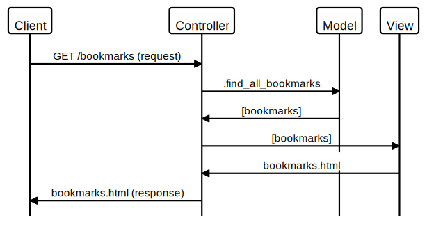

# Bookmark Manager

## User Stories

### Show a list of bookmarks

```
As a user
I would like to be able to see a list of my bookmarks
So that I can quickly find saved websites
```

| Object           | Methods            |
| ---------------- | ------------------ |
| Bookmark         |                    |
| Bookmark Manager | find_all_bookmarks |



### Add new bookmarks

```
As a user
I would like to add a new bookmark
So that I can acces it later
```

### Update bookmarks

```
As a user
I would like to update a bookmark
So that I can edit details about it
```

### Delete bookmarks

```
As a user
I would like to delete a bookmark
So that it is no longer listed on my bookmark manager
```

### Comment on bookmarks

```
As a user
I would like to be able to comment on a bookmark
So that I can make comments on my links
```

### Tag bookmarks into categories

```
As a user
I would like to be able to add a tag to my bookmarks
So that I can organise the bookmarks into categories
```

### Filter bookmarks by tag

```
As a user
I would like to be able to add a filter to my bookmarks
So that I can search for specific bookmarks
```

### Users are restricted to manage only their own bookmarks

```
As the developer
I would like to restrict bookmarks
So that the owner of the bookmark is the only one who can manage them
```
